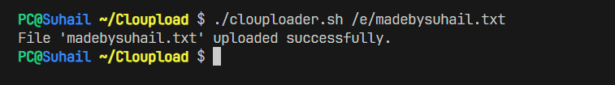

# Cloupload
A Bash-Based Azure CLI Tool for Seamless File Uploads to Azure Blob Storage



## Features
- Generate time-limited shareable links for uploaded files.
- Optional file encryption using GPG with AES-256 encryption.
- Supports dynamic handling of existing files (overwrite, skip, rename).

## Prerequisites
- **Active Azure Subscription**: Ensure you have an Azure subscription with permissions to create and manage Blob Storage containers.
- **Azure CLI**: Install and log in using `az login`. [Installation Guide](https://learn.microsoft.com/en-us/cli/azure/install-azure-cli)
- **GPG (GNU Privacy Guard)**: Required for file encryption. [Installation Guide](https://www.gnupg.org/download/index.html)
- **Bash**: A Bash shell is required (Linux, macOS, or Git Bash on Windows).

## How to setup
1. **Clone the Repository** to your local machine and move into the directory
   ```bash
   git clone https://github.com/yourusername/clouduploader.git
   cd clouduploader
   ```
2. **Run the config.sh script** to configure your Azure Storage credentials and create a .env file
   ```bash
   ./setup.sh
   ```
3. **Verify the .env file** has been created with the correct values
   ```bash
   cat .env
   ```

## How to use
**Make sure you are in the cloned directory**

- To upload a file to your Azure blob storage
```bash
./clouduploader.sh /path/to/file
```
- To encrypt the file before uploading
```bash
./clouduploader.sh /path/to/file --encrypt
```
- To upload a file and create a time-limited shareable link
```bash
./clouduploader.sh /path/to/file --link
```

## Troubleshooting
1. **Azure CLI Not Installed**  
   - Install Azure CLI: [Guide](https://learn.microsoft.com/en-us/cli/azure/install-azure-cli)  
   - Verify Installation:
     ```bash
     az --version
     ```

2. **Not Logged into Azure**  
   - Log in using:
     ```bash
     az login
     ```

3. **`.env` File Missing**  
   - Run the setup script:
     ```bash
     ./setup.sh
     ```
   Check the .env file to ensure your Azure credentials are saved:
   ```
   AZURE_STORAGE_ACCOUNT=<your_storage_account>
   AZURE_STORAGE_CONTAINER=<your_container_name>
   AZURE_STORAGE_KEY=<your_storage_key>
   ```

4. **File Not Found**  
   - Ensure the file/directory path is correct and exists.  
   - Example for checking file existence:
     ```bash
     ls /path/to/file  # Linux/macOS
     dir C:\path\to\file  # Windows (Command Prompt or PowerShell)
     ```


5. **Upload Fails**  
   - Check Azure credentials in `.env`:
     ```bash
     cat .env
     ```
   - Ensure the Azure container exists:
     ```bash
     az storage blob list --account-name <YourStorageAccount> --container-name <YourContainerName>
     ```

6. **Permission Denied Errors**  
   - **Linux/macOS**: Ensure proper script permissions:
     ```bash
     chmod +x clouduploader.sh
     ```
   - **Windows**: Run Git Bash or Command Prompt with Administrator privileges.

## Contribution
Feel free to open requests or [contact me](suhail2k3@gmail.com)